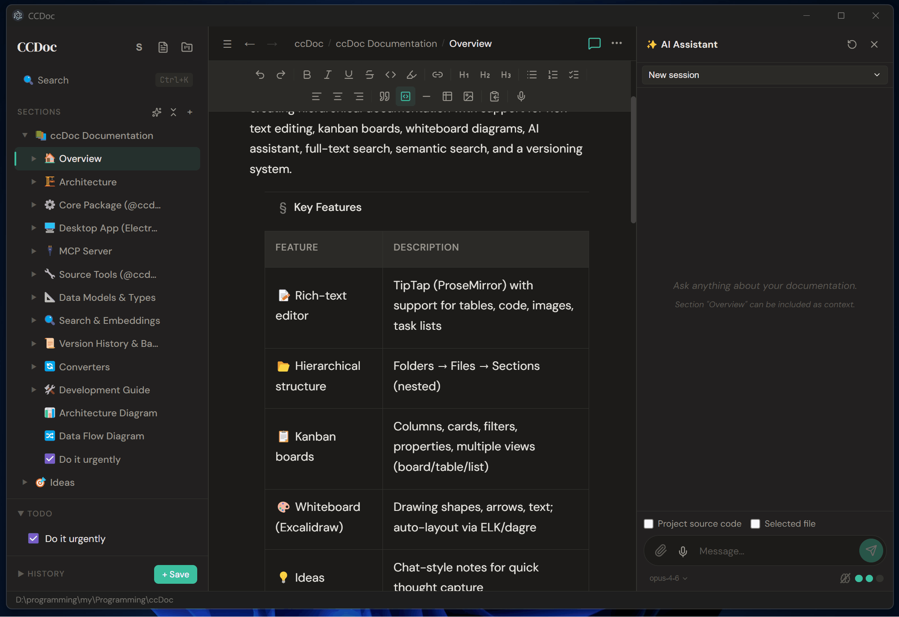

<p align="center">
  
</p>

# ccDoc

Desktop app for project documentation with a built-in AI assistant. Runs locally, data stays on your machine.

## Why?

Notion and Confluence are too heavy for personal/team docs. A folder of markdown files gets messy fast. ccDoc is somewhere in between — structured docs in a local app, with version history out of the box.

It also exposes your docs via [MCP](https://modelcontextprotocol.io/), so AI tools like Claude Code, Cursor or Windsurf can read and edit them directly.

## What's inside

**Documents** — rich text editor with tables, code blocks, images, checklists.

**Kanban boards** — columns, cards, labels, custom properties. Board / table / list views.

**Diagrams** — Excalidraw-based whiteboard. Shapes and arrows described in text, laid out automatically.

**Ideas** — quick chat-style notes. Can be turned into a plan or a kanban board later.

**Todo lists** — simple checklists.

**Search** — full-text search across everything.

**Version history** — Git-based, with rollback.

## AI assistant

Built-in Claude integration. Tell it what you need — it reads your docs and code, then creates or updates sections, generates diagrams, builds kanban boards.

Examples:
- *"document the auth flow based on the source code"*
- *"create an architecture diagram for the API layer"*

## MCP

ccDoc includes an MCP server. Install it for your AI tool from the app menu — no manual config needed.

## Getting started

### From a release

Grab the installer from the [Releases](https://github.com/dilaverdmn/ccDoc/releases) page.

### From source

```bash
pnpm install
pnpm build
pnpm dev
```

Node.js 20+ required.

## Build

After `pnpm install && pnpm build`:

```bash
cd packages/desktop

# Windows — installer + portable .exe
npx electron-builder --win

# macOS — .dmg + .zip
npx electron-builder --mac

# Linux — AppImage + .deb
npx electron-builder --linux
```

Output goes to `packages/desktop/release/`.

macOS and Linux builds are untested — issues and PRs welcome.

## Tech stack

Electron, React, TipTap, libSQL, isomorphic-git, Zustand, Excalidraw, Tree-sitter, ONNX Runtime.

## License

MIT
